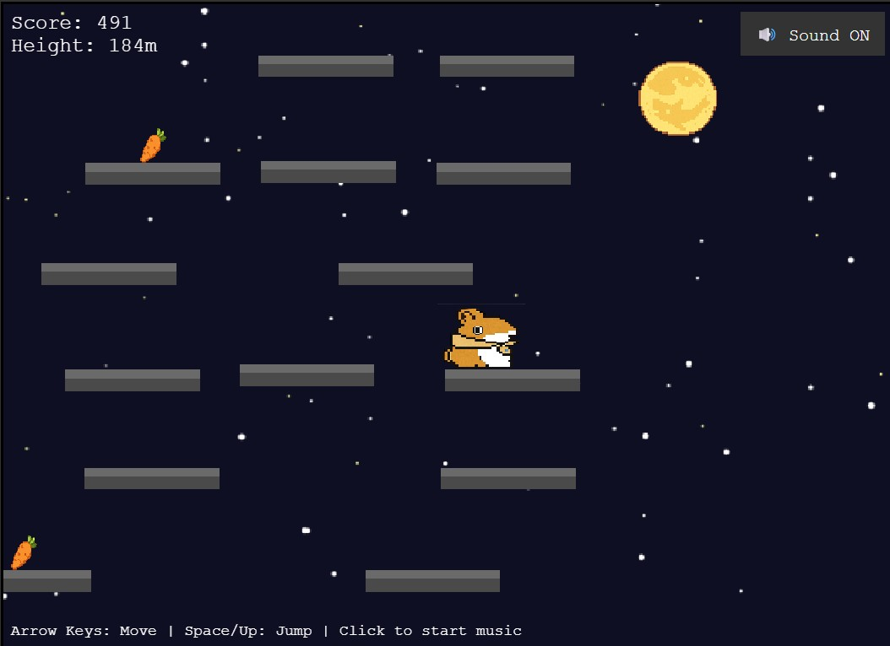

# うさめちゃんのスカイジャンプ (Usame-chan's Sky Jump)

<div align="center">

🎮 「おでかけ子ザメ」に登場する愛らしいキャラクター「うさめちゃん」が主役のファンメイド・無限ジャンプゲームです。

➡️ **[ゲームをプレイ！](https://staale92.github.io/usame-skyjump/)** ⬅️

</div>

---

<p align="center">
  
</p>

---

## 🐰 ゲームについて

『**うさめちゃんのスカイジャンプ**』は、ゲームエンジン **Phaser 3** を使って制作された、クラシックな無限上昇プラットフォーマーです。
原作者である **ペンギンボックス** 先生への愛と敬意を込めて、うさめちゃんを操作し、プラットフォームを次々とジャンプして空高く昇っていくことを目指すゲームです。

ニンジンを集めてスコアを稼ぎ、賑やかな街並みから静かな夜空へ、そして広大な宇宙空間へと進化していく背景をお楽しみください。

---

## ✨ ゲームの特徴

-   **無限に続く、プロシージャルな世界**
    -   プラットフォームは動的に生成されるため、毎回違うプレイが楽しめます。
-   **動的な難易度**
    -   高く登るにつれてプラットフォームが短くなったり不安定になったりし、挑戦性が増していきます。
-   **レスポンシブな操作性**
    -   ゲームの触り心地を向上させるため、「コヨーテタイム」や「ジャンプバッファリング」といったテクニックを導入しています。
-   **複数の背景ステージ**
    -   街、星空、そして星雲や流れ星が輝く宇宙空間を旅します。
-   **クロスプラットフォーム対応**
    -   デスクトップでもモバイルでも、タッチ操作に完全対応してプレイ可能です。
-   **プロシージャル・オーディオ**
    -   すべての効果音とBGMは、Web Audio APIを使用してリアルタイムに生成されます。

---

## 🕹️ 遊び方

### 🖥️ デスクトップでの操作

-   **左右移動**: `←` / `→`
-   **ジャンプ**: `↑` または `スペースキー`

### 📱 モバイルでの操作

-   **ジャンプ**: 画面のどこかを長押しします。
-   **移動**: 長押ししたまま、指を左右にドラッグします。

---

## 🧰 使用技術

-   **ゲームエンジン**: Phaser 3
-   **言語**: JavaScript (ES6+)
-   **オーディオ**: Web Audio API
-   **ホスティング**: GitHub Pages
-   **バージョン管理**: Git & GitHub

---

## 🛠️ ローカル環境での実行方法

このゲームを改造したり、コードを詳しく見たい場合は、以下の手順であなたのマシン上で実行できます。

1.  **リポジトリをクローンする**

    ```bash
    git clone [https://github.com/staale92/usame-skyjump.git](https://github.com/staale92/usame-skyjump.git)
    cd usame-skyjump
    ```

2.  **ローカルWebサーバーを起動する**

    最近のブラウザは、セキュリティ上の理由（CORSポリシー）からローカルファイルへのアクセス（`file:///...`）をブロックします。そのため、簡単なローカルサーバーからファイルを配信する必要があります。いくつか方法があります。

    -   **Node.js (`serve`) を使う方法**
        Node.jsがインストールされていれば、`serve` パッケージが利用できます。
        ```bash
        npx serve
        ```

    -   **Python 3 を使う方法**
        Python 3がインストールされていれば、組み込みのHTTPサーバーが利用できます。
        ```bash
        python -m http.server
        ```

    -   **VS CodeのLive Server拡張機能を使う方法**
        Visual Studio Codeのマーケットプレイスから [Live Server](https://marketplace.visualstudio.com/items?itemName=ritwickdey.LiveServer) 拡張機能をインストールします。その後、`index.html` ファイルを右クリックし、「Open with Live Server」を選択します。

3.  **ブラウザで開く**

    `http://localhost:8000`（Pythonの場合）や、`serve` またはLive Serverが指定したアドレス（通常は `http://127.0.0.1:5500`）にアクセスしてください。

---

## ⚠️ 免責事項とクレジット

このゲームは、原作への愛情と敬意から制作された、非公式・非営利のファンメイド作品です。

うさめちゃん、および「おでかけ子ザメ」シリーズに関するすべてのキャラクターの権利は、原作者である **ペンギンボックス** 先生に帰属します。

© PENGUINBOX

ぜひ公式の原作者様を応援してください！ [X (旧Twitter)](https://x.com/Penguinbox1) で活動をフォローできます。
